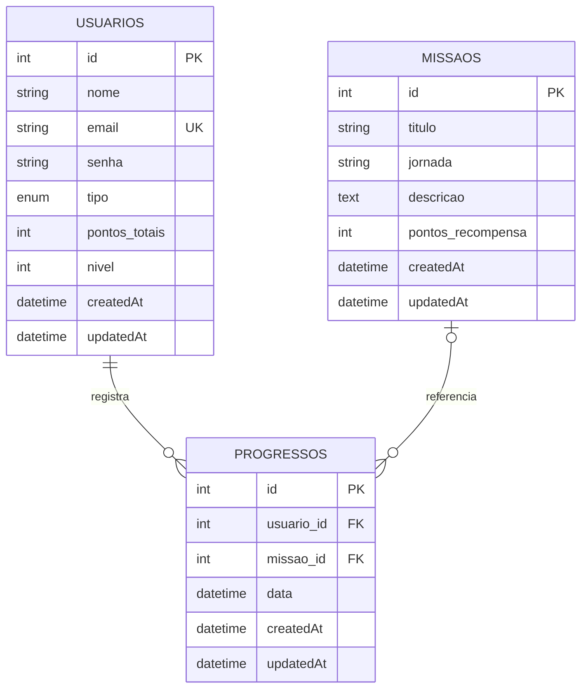

# Diagrama entidade-relacionamento

```mermaid
erDiagram
    USUARIOS ||--o{ PROGRESSOS : registra
    MISSAOS |o--o{ PROGRESSOS : referencia

    USUARIOS {
        int id PK
        string nome
        string email UK
        string senha
        enum tipo
        int pontos_totais
        int nivel
        datetime createdAt
        datetime updatedAt
    }
    MISSAOS {
        int id PK
        string titulo
        string jornada
        text descricao
        int pontos_recompensa
        datetime createdAt
        datetime updatedAt
    }
    PROGRESSOS {
        int id PK
        int usuario_id FK
        int missao_id FK
        datetime data
        datetime createdAt
        datetime updatedAt
    }
```

A chave única composta de `Progressos` reúne `usuario_id` e `missao_id`. A referência à missão pode ficar vazia quando a missão é excluída.
